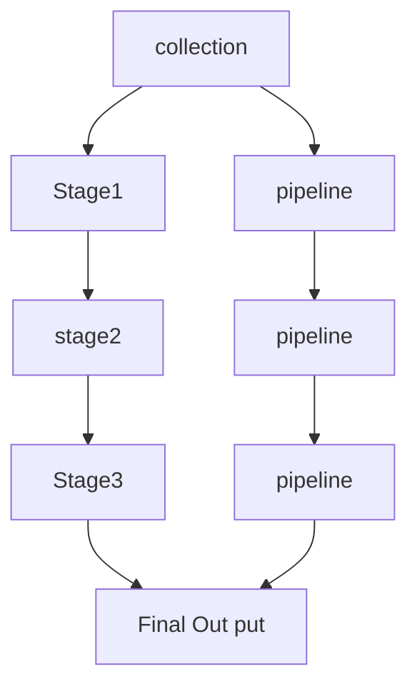

# Learn Aggregation :

## What is Aggregation?

- Aggregation is a way to process large number of documents in collection by
  means passing through different stages.
- The stages make up known as pipeline.
- The Stages in a pipeline can `filter` ,`sort`, `group`, `reshape` & `modify`
  and passing them through pipeline.

## Aggregation `Syntax` :

```js
   db.collection.aggregate([
      // stage one
      {} // : pipeline one
      // stage two
      {} // : pipeline two
      // stage three
      {} // : pipeline three
   ])

```

## Data flow in Aggregation :



## Aggregation Stages or Operators :

- #### `$match` :

  1.  `$match` fields allows us to choose those documents , that we want to work
      with.
  2.  we can find or filter
  3.  we can pass any query to find out our data in `$match `operator
  4.  syntax:

  ```js
  db.collection.aggregate([
    //match stage :
    { $match: query },
  ]);
  ```

  5.  Example :

  ```js
  db.test.aggregate([
    // stage1 :
    {
      $match: {
        age: { $lte: 50 },
        skills: { $elemMatch: { name: "JAVASCRIPT", level: "Expert" } },
      },
    },
  ]);
  ```

- #### `$project` : project stage works for project or selection properties which we need.

  - Here we used 1 or 0 to select or deselect properties.
  - syntax :

  ```js
  db.collection.aggregate([
    // match stage:
    // project stage :
    { $project: { propertyName: 1, propertyName: 1 } },
  ]);
  ```

  - Example :

  ```ts
  db.test.aggregate([
    //stage :
    {
      $match: {
        age: { $lt: 70 },
        skills: { $elemMatch: { name: "C#", level: "Intermidiate" } },
      },
    },
    //stage:
    { $project: { age: 1, skills: 1 } },
    //stage :
    {
      $addFields: {
        course: "Next Level Web Development",
        organization: "Programming Hero",
      },
    },
    // {$out: "level-2"},
    { $merge: "test" },
  ]);
  ```

  - `Rename` fields in Project:

    - syntax:

    ```ts
    {
      $project: {
        newPropertyName: "$fieldName";
      }
    }
    ```

    - Example:

    ```ts
       {

          $project: {
                totalSalary: 1,
                minSalary: 1,
                maxSalary: 1,
                averageSalary: "$avgSalary", // rename the fields
                minMaxSalaryRange : {$subtract: ["$maxSalary","$minSalary"]}, // subtract in project

          }
       }

    ```

- #### `$addFields` : Adds new fields to documents.

  - But not modify the existing documents :
  - syntax:

  ```js
  db.collection.aggregate([
    // match stage :
    { $match: { age: { $lte: 20 } } },
    // addFields stage :
    { $addFields: { newPropertyName: value, newPropertyName: value } },
  ]);
  ```

  - Example :

  ```ts
  db.test.aggregate([
    //stage :
    {
      $match: {
        age: { $lt: 70 },
        skills: { $elemMatch: { name: "C#", level: "Intermidiate" } },
      },
    },
    //stage:
    { $project: { age: 1, skills: 1 } },
    //stage :
    {
      $addFields: {
        course: "Next Level Web Development",
        organization: "Programming Hero",
      },
    },
    // {$out: "level-2"},
    { $merge: "test" },
  ]);
  ```

  - Output:

  ```json
  [
    // every documents looks like :
    {
      "age": 1,
      "skills": [
        {
          "name": "JAVASCRIPT",
          "level": "Intermediate",
          "isLearning": false
        },
        {
          "name": "C#",
          "level": "Intermediate",
          "isLearning": false
        },
        {
          "name": "C",
          "level": "Intermediate",
          "isLearning": false
        }
      ],
      "course": "Next Level Web Development",
      "organization": "Programming Hero"
    },
    {
      "age": 1,
      "skills": [
        {
          "name": "JAVASCRIPT",
          "level": "Intermediate",
          "isLearning": false
        },
        {
          "name": "C#",
          "level": "Intermediate",
          "isLearning": false
        },
        {
          "name": "C",
          "level": "Intermediate",
          "isLearning": false
        }
      ],
      "course": "Next Level Web Development",
      "organization": "Programming Hero"
    }
  ]
  ```

- #### `$out` : create a `new collection` with `previous stage` `documents`.

  - syntax:

  ```ts
  db.collection.aggregate([
    // merge Stage :
    // others stage :
    // out stage :
    { $out: "new collection name" },
  ]);
  ```

  - Example :

  ```ts
  db.test.aggregate([
    //stage :
    {
      $match: {
        age: { $lt: 70 },
        skills: { $elemMatch: { name: "C#", level: "Intermidiate" } },
      },
    },
    //stage:
    { $project: { age: 1, skills: 1 } },
    //stage :
    {
      $addFields: {
        course: "Next Level Web Development",
        organization: "Programming Hero",
      },
    },
    { $out: "level-2" },
  ]);
  ```

- #### `$merge` stage : Merge the `previous stage ` documents with `an existing collection`

  - merge stage can modify existing collections
  - syntax :

  ```ts
  db.collection.aggregate([
    // match stage :
    // others stage :
    // merge stage :
    { $merge: "existing  collection" },
  ]);
  ```

  - Example:

  ```ts
  db.test.aggregate([
    //stage :
    {
      $match: {
        age: { $lt: 70 },
        skills: { $elemMatch: { name: "C#", level: "Intermidiate" } },
      },
    },
    //stage:
    { $project: { age: 1, skills: 1 } },
    //stage :
    {
      $addFields: {
        course: "Next Level Web Development",
        organization: "Programming Hero",
      },
    },
    { $merge: "test" },
  ]);
  ```

- ### `$group` stage operators:

  - In group stage we can group data with any specific `fields`
  - In Group stage we must provide an `_id` and it's value will `null` or
    `$fieldName`.
  - If we provide `null` , in group we found all documents from collection.

  ```js
  db.collection.aggregate([
    // get all data:
    {
      $group: { _id: null, total: { $sum: 1 } },
    },
    // sum : 1 means calculate documents number in collection.
  ]);
  ```

  - If we provide `$fieldName` the data will be groupe.

  ```js
  db.collection.aggregate([
    // create group with $gender fields:
    // sum : "$salary" calculate the the total salary by adding every document salary
    {
      $group: { _id: "$gender", total: { $sum: "$salary" } },
    },
  ]);
  ```

  - Here we can `count`, `sum`, `average`, `find maximum`,
    `find minimum `and` push` data on array.
  - For complete `$group` operation we can use `$count`, `$sum`, `$min`,
    `$max`, `$avg` and `$push`
  - Example :

  ```ts
  db.test.aggregate([
    // stage -> 1:
    {
      $group: {
        _id: null,
        totalSalary: { $sum: "$salary" },
        minSalary: { $min: "$salary" },
        maxSalary: { $max: "$salary" },
        avgSalary: { $avg: "$salary" },
        data: { $push: "$$ROOT" },
      },
    },

    // stage -> 2:
    {
      $project: {
        totalSalary: 1,
        minSalary: 1,
        maxSalary: 1,
        averageSalary: "$avgSalary", // rename the fields
        minMaxSalaryRange: { $subtract: ["$maxSalary", "$minSalary"] }, // substract in project
      },
    },
  ]);
  ```

- #### `$unwind`: `$unwind` method helps us to separate every `array` elements.

  - and `reuse` the array element for every documents:
  - syntax:

  ```ts
  {
    $unwind: "$arrayFieldName";
  }
  ```

  - Suppose we have an documents like this:

  ```json
        [
          {
              "_id" : ObjectId("65534b7c6f0724dab1759586"),
              "friends" : [ "Rakib", "Ratul", "Roman" ]
           }
        ]
  ```

  - After using `$unwind` method: the documents separated for every array item
    but others data can't change.

  ```ts
     /* 1 createdAt:11/14/2023, 4:27:08 PM*/
        {
           "_id" : ObjectId("65534b7c6f0724dab1759586"),
           "friends" : "Rakib"
        },

        /* 2 createdAt:11/14/2023, 4:27:08 PM*/
        {
           "_id" : ObjectId("65534b7c6f0724dab1759586"),
           "friends" : "Ratul"
        },

        /* 3 createdAt:11/14/2023, 4:27:08 PM*/
        {
           "_id" : ObjectId("65534b7c6f0724dab1759586"),
           "friends" : "Roman"
        }
  ```

  - Example:

  ```ts
  db.test.aggregate([
    // stage -> 1:
    { $unwind: "$friends" },
    // stage -> 2:
    { $unwind: "$interests" },
    // stage -> 3:
    {
      $group: {
        _id: "$age",
        agePerFriends: { $push: "$friends" },
        agePerInterests: { $push: "$interests" },
      },
    },
  ]);
  ```

---

# Node js And Express js Master

## what javascript is invented?

- Answer:
        user can interactive browser using `javascript` access between `DOM` `CSS` .only run within browser give me interactive ui

## Why Node.js is built?

 - Answer:
        we do not use `js ` within server side

## What is node.js?

- Answer:
        Node js is a runtime . Run code server side using chrome v8 engine v8 engine parse javascript code and run machine .

### Node.js Modules

- Answer:

        -- Operating System Module (os)
        -- File System Module (fs)
        -- Path Module (path)
        -- HTTP Module (http)
        -- URL Module (url)
        -- Utilities Module(util)
 ### why node.js popular?

 - We cna use `js` on server side
 - Build higly scalable backend application
 - It is single threaded , event driven and works non blocking I/O
 - Perfect building data intensive, streaming application

### cons of using node.js
- Highly cpu intensive tasks

- But you cna do using worker threads

### Dependencies of Node js

 - V8 Engine: Node js runtime is based on V8 Engine written in `c++ & js`. without V8 Node` js `would never understand javascript code.

 - Libuv: Libuv is an open source library written on c++ which focuses on `asynchronous I/O` and gives node access to 
 `Computer OS`, `File Systems`, `Networking`, etc.


### Libuv implements 2 important Parts of Node JS
- Event Loop: Executes callback functions, Network I/O. 
- Thread Pool: CPU intensive Tasks, File Access, File Compression, Cryptography

### What is a module
A module is an isolated and resuable block of code that has its own scope

#### Modular System
- Node js Now supports ESM Module(`version>=14`)

|----------commonjs------|------esm---------|
|       require         |       Import       |
|       export/module.exports | export default |
|       .js             |       .mjs            |

- -----------------------------------------------

- Local Modules`we create`
- Built in modules `come with node.js`
- Third party modules `created by others`

```js

Module {
  id: '.',
  path: 'E:\\Be-a-Mongoose-Master',
  exports: {},
  filename: 'E:\\Be-a-Mongoose-Master\\local-1.js',
  loaded: false,
  children: [],
  paths: [ 'E:\\Be-a-Mongoose-Master\\node_modules', 'E:\\node_modules' ]
}

```


### local Modules:
- local-1.js
```js
        const add =(param1, param2)=>param1+ param2;
        const a=10;
        module.exports={
                a,
                add
        };
        console.log(module);

```

- local-1.js
```js
        const add =(param1, param2, param3)=>param1+ param2+param3;
        const a=10;
        module.exports={
                a,
                add
        };
```

- index.js
```js
        const {a, add}=require('./local-1');
        const {a:a2, add:add2}=require('./local-2');


        console.log(add2(3,4, 5 ));

```

### built-in module

```js
const path = require("path")
console.log(path.join("/E:/Be-a-Mongoose-Master/", "local-1.js"));
console.log(path.parse("/E:/Be-a-Mongoose-Master/index.js"));

```

### synchronous is a blocking behaviour akter poer akta kore kaj


### asynchronous away te kaj kore node js ----> single threaded theke ---> thread pool ar kache pathai
- Example:
```js
const fs = require("fs");

// reading text asynchronously

fs.readFile('./texts/read.txt', "utf-8", (error, data)=>{
        if(error){
                throw Error("Error reading text");
        }

// writitng file
        fs.writeFile('./texts/read2.txt', data, "utf-8", (err)=>{
                if(err){
                        throw Error("error writting data")
                }
        })
})
console.log("testing asynchronously");

```


-------------------------------------------------------------------------------------------------
# Event Driven Architecture

-- Event Emitter _`Emit Events`___> Event listener ______`Call`______> Callback

```js
const EventEmitter = require("events")

const myEmitter = new EventEmitter()

// listener

myEmitter.on('birthday', ()=>{
        console.log("Happy birthday to you");

})
myEmitter.on('birthday', (gift)=>{
        console.log(` I will send a gift ${gift}`);

})

myEmitter.emit('birthday', "watch")


```

### stream and Buffer
- It is used to process  a data `piece by piece` which is called buffer.
- it is better in terms of user experience
- Needs short memory storage as it do not complete whole process at once
- needs low memory space
data flow ---> piece| piece| Piece| ---> together --->loading -->buffer

#### Different types of streams

1. Readable Stream - a stream where we can read data (ex.http req, fs.readStream)
2. writable stream - a stream where we can write data (ex. http response, fs, writeStream)
3. Duplex stream - a stream for both write and read
4. Transform stream - a stream where can we reshape data


```js
const http=require("http");
const fs = require('fs');
// creating a server using raw node.js

const server=http.createServer()

server.on('request', (req, res)=>{
        if(req.url==='/read-file' && req.method==="GET");
        const readableStream=fs.createReadStream(process.cwd() + '/texts/read.txt')
        readableStream.on('data', (buffer)=>{
                res.statusCode = 200;
                res.write(buffer);
        })

        readableStream.on('end', ()=>{
                res.statusCode = 200;
                res.end("hello............")
        })
        readableStream.on('error', (error)=>{
                console.log(error);
                res.statusCode = 500;
                res.end("hello............")
        })
        
})

server.listen(5000, ()=>{
        console.log("server is running");
})

```


---------------------------------------------------------------------------------------------------------------
# Express js start Time 6:38 pm 11/15/2023

## install process command
-  npm init -y 
- yarn add express 
- yarn add -D typescript 
- tsc-init 
- yarn add -D @types/node 
- yarn add -D @types/express
- yarn add -D nodemon
- tsc -w


#### package.json 
 - start:dev: 'nodemon ./dist/server.ts'


 ```js
 import express, { Request, Response } from 'express';
const app = express()
// parsers
app.use(express.json());
// middleWare
const logger=(req:Request, res:Response, next:NextFunction)=>{
        console.log(req.url, req.method, req.hostname, req.query);
        next();
}
app.get('/', (req:Request, res:Response) => {
        console.log(req.query);//?email="ala@gmail.com"&name=alamin
        console.log(req.body);
        console.log(req.params);// /:userId/:id
  res.send('Hello world !')
})

app.post('/', (req:Request, res:Response)=>{
        console.log(req.body)
        res.send("back response");
})

export default app;
 
 ```

 ## what is middleWare?
 - middleware is function . middleware check authorization, and another validation, and recive req process some task then send the next() work. 

 middleware ---> req, -->next ---- >Route Access


# Make own Route in express js file

```js

const userRouter = express.Router();

app.use("/", userRouter);
userRouter.get("/api/v1/users/create-user", (req: Request, res: Response) => {
  const user = req.body;
  console.log(user);
  res.json({
    success: true,
    message: "user is created successfully",
    data: user,
  });
});

const logger = (req: Request, res: Response, next: NextFunction) => {
  console.log(req.url, req.method, req.hostname, req.query);
  next();
};
app.get("/", logger, (req: Request, res: Response, next:NextFunction) => {

  try {
        // console.log(something);
  } catch (error) {
        next(error);
  }
});

```


 ## global error handler & route missing handler

 ```js
 
 
app.all("*", (req:Request, res:Response)=>{
        res.status(400).json({
                success:false,
                message:"Route is not found"
        })
})
// global error handler

app.use((error: any, req: Request, res: Response, next: NextFunction) => {
  if(error){
        res.status(400).json({
                success:false,
                message:"Something went wrong"
        })
  }
});
 ```


